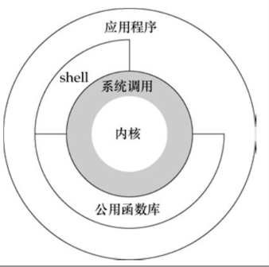

## 1Unix基础知识

### 1.2Unix体系结构

内核的结构被称为**系统调用**(system cal)。

**公用函数库**	<!--类似libc库--> 建立在系统调用接口上。

**应用程序**既可以使用公用函数库，也可以使用系统调用。

**shell**是一个特殊的应用程序，为运行其他应用程序提供接口。

​	

### 1.3登录

#### 1.3.1登录名

用户登陆unix系统，先键入登录名，后键入口令。

系统会验证口令文件(`/etc/passwd`)。登录项为`sar:x:205:105:Stephen Rago:/home/sar:/bin/ksh`

> [sar]:登录名  [x]:加密口令 [205]:数字用户id [105]:数字组id 
>
> [Stephen Rago]:注释字段	[/home/sar]:家目录   [/bin/ksh]:默认shell

shell本质是一个**命令行解析器**，它读取用户输入，然后执行相应的命令。

### 1.4文件和目录

#### 1.4.1文件系统	

unix文件系统是目录和文件的一种层次结构，**起点是root的目录**，字符为'/'。

**目录**(directory)是一个包含目录项的文件。逻辑上认为**目录项**是一个包含文件名和文件属性信息的结构。

#### 1.4.2文件名

目录中的各个名字称为**文件名**(filename)。只有斜线(/)和空格符这两个字符不能出现在文件名中。

**斜线**用来分隔构成路径名的各文件名，**空字符**用作路径名的终止符(类似'\0')。

创建新目录时会自动创建两个文件名：**.(点)**和**..(点点)**。点指向当前目录，点点指向父目录。

> 在根目录中，点点与点指向相同。
>

#### 1.4.3路径名

由斜线分隔的一个或多个文件名组成的序列构成**路径名**(pathname)。

以斜线开头的路径被称为**绝对路径名**(absolute pathname)，否则被称为**相对路径名**(relative pathname)。

文件系统根的名字(/)是一个特殊的绝对路径名，它不包含文件名。

查看unix系统`ls`命令的man帮助手册页：`man l ls`或者 `man -s1 ls`。

> - 1表示第一部分，表示用户命令的说明
> - 2表示第二部分，系统调用的说明
> - 3表示第三部分，C标准库函数的说明
> - 4表示第四部分，设备和特殊文件（通常位于/dev/）的说明
> - 8表示第八部分，系统管理员命令的说明（通常只有root可用）

#### 1.4.4工作目录

每个进程都有一个**工作目录**(working directory)，有时有称其为**当前工作目录**(current working directory)。

所有的相对路径名都是从工作目录开始解释的。进程可以用`chdir()`函数更改其工作目录。

#### 1.4.5家目录

登录时，工作目录会被设置为**家目录**(home directory)，该家目录从口令文件中相应用户的登陆项中获得。

### 1.5输入和输出

#### 1.5.1文件描述符

**文件描述符**(file descriptor)通常是一个小的非负整数，内核用以标识一个特定进程正在访问的文件。

#### 1.5.2标准输入、标准输出和标准错误

每当运行一个新程序时，所有的shell都为其打开3个文件描述符，即**标准输入**(standard input)、**标准输出**(standard output)以及**标准错误**(standard error)。

```bash
$bash: a.out < infile > output  //将标准输入重定向到infile
$bash: ls > file.list //将标准输出重定向到file.list文件
$bash: ls > file.list 2>&1  //同时将标准错误重定向到标准输出
0 -> stdin  1 -> stdout  2->stderr
```

#### 1.5.3不带缓冲的I/O

函数`open()`、`read()`、`write()`、`lseek()`以及`close()`提供了不带缓冲的I/O。

出错时大多数系统函数返回-1。

#### 1.5.4标准I/O

标准I/O函数为不带缓冲的I/O函数提供了一个带缓冲的接口，比如printf()函数。

### 1.6程序和进程

#### 1.6.1程序

**程序**(program)是一个存储在磁盘上的可执行文件。

> 本质上是二进制字节序存储的可加载文件

#### 1.6.2进程和进程id

程序的执行实例被称为**进程**(processs)。

> 本质上是加载进内存、占用系统资源(cpu、内存)的程序。

unix系统确保每个进程都有一个唯一的数字标识符，称为**进程id**(process id)。进程id总是一个非负整数。

可以调用`getpid`()函数获得当前进程的id。其返回一个`pid_t`数据类型。

#### 1.6.3进程控制

有三个用于进程控制的主要函数：`fork()`、`exec()`、`waitpid()`。

#### 1.6.4线程和线程id

通常，一个线程只有一个**控制线程**(thread)。

一个进程内的所有线程共享同一地址空间、文件描述符、栈以及进程相关的属性。

由于能访问同一内存区，所以各线程在访问共享数据时需要采取同步措施以避免不一致性。

与进程相同，线程也用id标识。但是**线程id**只在它所属的进程内才有意义。

### 1.7出错处理

当unix系统函数出错时，通常会返回一个负值，而且整型变量`errno`通常被设置为具有特定信息的值。

文件`<errno.h>`中定义了`errno`以及赋予它的各种常量，这些常量都以字符E开头。

POSIX和ISO C将`errno`定义为一个全局符号，其可扩展为一个可修改的整形左值(lvalue)。它可以是一个包含出错编号的整数，也可以是一个返回出错编指针的函数。		

```c
extern int errno;
```

但是在支持线程的环境中，每个线程都有属于自己的局部errno以避免一个线程干扰另一个线程。

```c
//Linux支持多线程存取errno
extern int *__errno_location(void);
#define errno (* __errno_location())
```

对于`errno`应当注意两条规则：

- 如果没有出错，`errno`值**不会被列程清除**。因此仅当函数的返回值指明出错时，才检验其值。
- **任何函数都不会将errno值设置为0**，且在`<errno.h>`中定义的所有常量都不为0。

C标准定义了两个函数用于打印出错信息：

```c
#include<string.h>
char *strerror(int errnum);
//函数的返回值：指向消息字符串的指针
```

`strerror()`函数将`errnum`(通常为`errno`值)映射为一个出错消息字符串，并且返回此字符串的指针。

```c
#include<stdio.h>
void perror(cosnt char *msg);
```

`perror()`函数首先输出由msg指向的字符串，然后是一个冒号，一个空格，接着是对应于`errno`值出错的消息，最后接'\n'。

可将`<errno.h>`中定义的错误分成两类：

- **致命性错误**：无法执行恢复动作，最多只能在屏幕上打印一条出错消息或将出错消息写入日志，然后退出。
- **非致命性错误**：有时可以妥善处理。大多数非致命性出错是暂时的(如资源短缺)。

与资源相关的非致命性错误包括：`EAGAIN ENFILE ENOBUFS ENOLCK ENOSPC EWOULDBLOCK`

有时`ENOMEM`、`EBUSY`指明共享资源正在使用时，`EINTR`中断一个慢速系统调用时，也都可作为非致命性错误。

对于资源相关的非致命性出错的典型恢复操作是延迟一段时间，然后重试。

### 1.8用户标识

#### 1.8.1用户id

口令文件登录项中的**用户id**(user id)是一个数值，它向系统标识各个不同的用户。通常每个用户有一个唯一的用户id。

用户id为0的用户为根用户(root)或超级用户(superuser)。具有超级用户特权。

#### 1.8.2组id

口令文件登录项包括用户的**组id**(group id)数值。组被用于将若干用户集合，允许同组的各个成员之间共享资源。

组文件将组名映射为数值的组id，组文件通常为`/etc/group`。

#### 1.8.3附属组id

一个用户可以属于多个其他组。这些组就是该用户的附属组。用组id来标识这些**附属组id**。

### 1.9信号

**信号**(signal)用于通知进程发生了某种情况。进程有三种处理信号的方式：

- **忽略信号**。
- 按**系统默认**方式处理。
- **捕捉信号**。提供一个处理函数(handler)，信号发生时调用该函数。

终端键盘上产生信号的方法：

- **中断键**(interrupt key)，通常是Delete键或Ctrl+C产生`SIGINT`信号。和**退出键**(quit key)，通常是Ctrl+C产生`SIGQUIT`。它们用于中断当前运行的进程。
- 调用**kill()**函数，可以在一个进程向另一个进程发送一个信号。(当前用户是该进程的所有者，或当前用户是root)。

### 1.10时间值

UNIX系统使用两种时间：

- **日历时间**：该值是自协调世界时(Coordinated Universal Time, UTC)1970年1月1日00:00:00以来所经历的秒数累计值。用`time_t`数据类型来保存这种时间值。
- **进程时间**：也被称为CPU时间，用以度量进程使用的中央处理器资源。进程时间以时钟滴答计算，用`clock_t`保存这种时间。

> 每秒曾经取为50、60或100个时钟滴答。

当度量一个进程的执行时间时，unix系统为一个进程维护了3个进程时间值：

- **时钟时间**：又被称为墙上时钟时间(wall clock time)，是进程运行的时间总量，其值与系统中同时运行的进程数有关。
- **用户CPU时间**：执行用户指令所用的时间量。
- **系统CPU时间**：该进程执行内核程序所经历的时间。

> 每当一个进程执行一个系统调用，如read和write时，在内核执行该操作所花费的时间就计入该进程的系统CPU时间。

用户CPU时间和系统CPU时间之和常被称为**CPU时间**。

在shell中执行命令`time(1)`可以获取进程的时钟时间、用户CPU时间和系统CPU时间。

```bash
$bash: cd /usr/include
$bash: time -p grep _POSIX_SOURCE */*.h > /dev/null
real		om0.81s
user		om0.11s
sys			om0.07s
```

