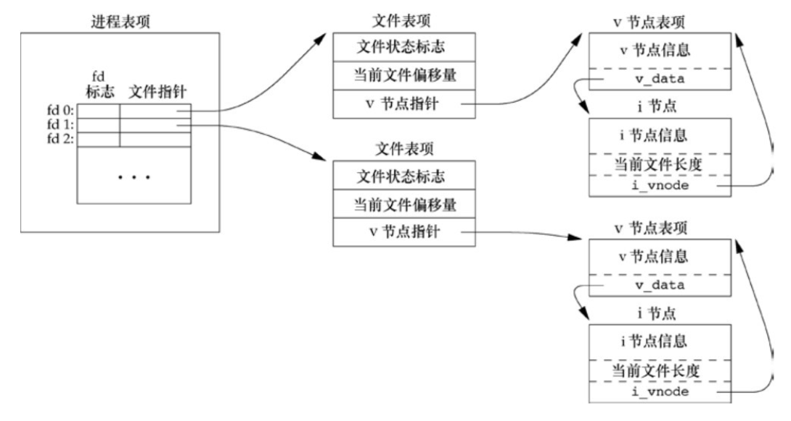
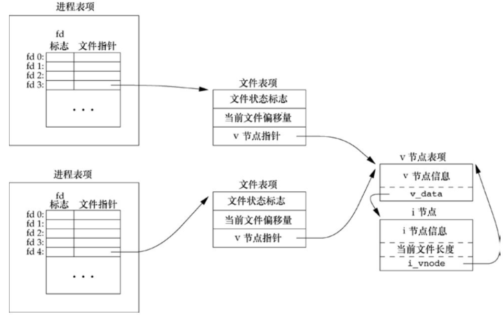

## 3文件I/O

### 3.2文件描述符

对于内核而言，所有打开的文件都是通过文件描述符引用。其是一个非负整数，范围在`0～OPEN_MAX-1`。

unix系统shell会默认打开3个文件描述符：

- fd0  -> 标准输入
- fd1  -> 标准输出
- fd2  -> 标准错误

通常我们应该使用`STDIN_FILENO` 、`STDOUT_FILENO`、 `STDERR_FILENO`来替换这三个幻数。这些常量定义在`<unistd.h>`中。

### 3.3函数open和openat

调用`open()`或`openat()`可以打开或创建一个文件。

```c
#include<fcntl.h>
int open(const char *path, int oflag, ... /* mode_t mode */);
int openat(int fd, const char *path, int oflag, ... /* mode_t mode */);	
//两函数的返回值：若成功，返回fd；若出错，返回-1
```

`path`参数是要打开或创建文件的名字。

`oflag`参数用来说明函数的行为：(可多个常量执行“或运算”构成`oflag`参数)

- `O_RDONLY`:		  只读打开。
- `O_WRONLY`:		  只写打开。
- `O_RDWR`:			  读、写打开。
- `O_EXEC`：			只执行打开。
- `O_SEARCH`：		只搜索打开(应用于目录)。

 这5个常量必须指定一个且只能指定一个。下列常量为可选：

- `O_APPEND`:		 每次写时都追加到文件的尾端。
- `O_CLOEXEC`:       `fd`标志位设置`FD_CLOEXEC`常量。
- `O_CREAT`:           若此文件不存在则创建它。需同时说明第三个参数`mode`。
- `O_DIRECTORY`:  若`path`引用的不是目录，则出错。
- `O_EXEL`:              若同时指定了`O_CREAT`，而文件已经存在，则出错。
- `O_NOCTTY`:         若`path`引用的是终端设备，则不将该设备分配作为此进程的控制终端。
- `O_NOFOLLOW`:  	若`path`引用的是一个符号链接(软连接)，则出错。
- `O_NONBLOCK`:    若`path`引用的是一个FIFO、块或字符特殊文件，则文件的本次打开操作和后续的I/O操作设置为非阻塞模式。
- `O_SYNC`:             每次写操作等待物理I/O操作完成，包括由该写操作引起的文件属性更新所需的I/O。
- `O_TRUNC`:          若此文件存在，且为`O_WRONLY`或`O_RDWR`成功打开，则将文件长度截断为0。
- `O_TTY_INIT`:    若打开一个还未打开的终端设备，设置非标准`termios`参数值。
- `O_DSYNC`:           使每次写操作要等待物理I/O操作完成，若该写操作不影响读取刚写入的数据，则无需等待文件属性更新。
- `O_RSYNC`:           使每一个以`fd`为参数进行的读操作等待，直至所有对文件同一部分挂起的写操作都完成。

由`open()`和`openat()`返回的`fd`一定是最小的未用的fd数值。

`fd`参数把`open()`和`openat()`区分开，共有三种可能性：

- `path`参数指定的是绝对路径名，此时`fd`被忽略，`openat(`)相当于`open()`。
- `path`参数指定的是相对路径名，`fd`参数打开的目录作为相对路径名在文件系统中的开始地址。
- `path`参数指定了相当路径名，`fd`参数具有特殊值`AT_FDCWD`。路径名在当前工作目录中获取，`openat()`相当于`open()`。

TOCTTOU(time of check to time of use)错误的基本思想是：如果有两个基于文件的函数调用，其中第二个调用依赖于第一个调用的结果，那么程序是脆弱的。因为两个调用不是原子操作，在两个函数调用之间文件可能改变了，这也就造成了第一个调用的结果就不再有效，使得程序最终的结果是错误的。

在POSIX.1中，常量`_POSIX_NO_TRUNC`决定是要截断要截断过长的文件名或路径名，还是返回一个出错。

若`_POSIX_NO_TRUNC`有效，则在整个路径名超过`PATH_MAX`，或路径名中的任一文件名超过`NAME_MAX`时，出错返回，并将`errno`设置为`ENAMETOOLONG`。

### 3.4函数creat

调用`creat()`创建一个新文件。

```c
#include<fcntl.h>
int creat(const char *path, mode_t mode);
//函数的返回值：若成功，返回因只写打开的fd；若出错，返回-1
```

此调用等效于：`open(path, O_WRONLY | O_CREAT | O_TRUNC, mode)`，其中`creat()`是以只写方式打开所创建的文件。

### 3.5函数close

调用`close()`关闭一个打开文件。

```c
#include<unistd.h>
int close(int fd);
//函数的返回值：若成功，返回0；若出错，返回-1
```

关闭一个文件时还会释放该进程加在该文件上的所有记录锁。

当一个进程终止时，内核会自动关闭它所有的打开文件。

### 3.6函数lseek

每个打开文件都有一个与其相关联的“当前文件偏移量”(current file offset)。它通常是一个非负整数，用以度量从文件开始处计算的字节数。通常，读、写操作都是从当前文件偏移量出开始，并使偏移量增加所读写的字节数。

按系统默认的情况，当打开一个文件时，除非指定`O_APPEND`选项，否则该偏移量被设置为0。

调用`lseek()`显式地为一个打开的文件设置偏移量。

```c
#include<unistd.h>
off_t lseek(int fd, off_t offset, int whence);
//函数的返回值：若成功，返回新的文件偏移量；若出错，返回-1
```

`whence`参数必须是`SEEK_SET`、 `SEEK_CUR`、`SEEK_END`三个常量之一。

`offset`参数的解释与参数`whence`的值有关：

- 若`whence`是`SEEK_SET`，则将该文件的偏移量设置为距文件开始处`offset`个字节。
- 若`whence`是`SEEK_CUR`，则将该文件的偏移量设置为其当前值加`offset`，`offset`可为正或负。
- 若`whence`是`SEEK_END`，则将该文件的偏移量设置为文件长度加`offset`，`offset`可正可负。

可以用这种方式确定打开文件的当前偏移量：

```c
off_t currpos;
currpos = lseek(fd, 0, SEEK_CUR);
```

如果`fd`指定的是一个管道、FIFO或网络套接字，则`lseek()`返回-1，并将`errno`设置为`ESPIPE`。

通常，文件的当前偏移量应当是一个非负整数。但是某些设备也可能允许负的偏移量，但普通文件的偏移量必须是非负值。因为在比较`lseek()`的返回值时，不要测试它是否小于0，而应该测试它是否等于-1。

`lseek()`仅将当前的文件偏移量记录在内核中，并不引起任何的I/O操作。然后该偏移量用于下一个读或写操作。

文件偏移量可以大于文件的当前长度，在这种情况下对该文件的下一次写操作将加长该文件，并在文件中构成一个空洞。位于文中未写过的字节都被解释为0。

> 文件中的空洞并不要求在磁盘上占用存储区，具体处理方式与文件系统的实现有关。
>
> 使用od(1)命令可以观察文件的实际内容， -c标志表示以字符方式打印文件内容。
>
> `$bash: od -c file.hole`
>
> 对于两个文件的长度相同，但无空洞的文件占用的磁盘块数量会比有空洞的多。
>
> 尽管可以实现64位文件偏移量`off_t`，但能否创建一个大于2GB( $2^31 - 1$ )的文件则依赖于底层文件系统的类型。

### 3.7函数read

调用`read()`从打开的文件中读数据。

```c
#include<unistd.h>
ssize_t read(int fd, void *buf, size_t nbytes);
//函数的返回值：读到的字节数，若已读到文件尾，返回0；若出错，返回-1
```

有多种情况可使实际读到的字节数少于要求读的字节数：

- 读普通文件时，在读到要求字节之前已达到了文件尾端。
- 当从终端设备读时，通常一次最多读一行(终端默认是行缓冲的)。
- 当从网络读时，网络中的缓存机制可能造成返回值小于所要求的字节数。
- 当从管道或FIFO读时，如若管道包含的字节少于所需的数量，那么read将只返回实际可用的字节数。
- 当从某些面向记录的设备(如磁带)读时，一次最多返回一个记录。
- 当一个信号造成中断，而已经读了部分数据量时。

### 3.8函数write

调用`write()`向打开的文件写数据。

```c
#include<unistd.h>
ssize_t wrtie(int fd, const void *buf, size_t nbytes);
//函数的返回值：若成功，返回已写的字节数；若出错，返回-1
```

`write()`的返回值通常与参数`nbytes`的值相同，否则表示出错。`write()`出错的一个常见原因是磁盘已写满，或者超过了一个给定进程的文件长度限制。

对于普通文件，写操作从文件的当前偏移量处开始的。如果在打开该文件时，指定了`O_APPEND`选项，则在每次写操作之前，将文件偏移量设置在文件的结尾处。在一次写成功之后，该文件偏移量增加实际写的字节数。

### 3.10文件共享

内核使用3种数据结构表示打开文件，它们之间的关系决定了在文件共享方面一个进程对另一个进程可能产生的影响。

- 每个进程在自己的进程表中都有一个记录项，记录项包含一张打开的`fd`表，可将其视为一个矢量，每个描述符占用一项。与每个`fd`相关联的是：
  1. **`fd`标志位**(如`FD_CLOEXEC`)。
  2. 指向一个文件表项的指针。
- 内核为所有打开文件维持一张文件表。每个文件表项包含：
  1. **文件状态标志位**(如`O_RDONLY`、`O_WRONLY`、`O_RDWR`、`O_APPEND`、`O_SYNC`、`O_NONBLOCK`)。
  2. 当前文件偏移量。
  3. 指向该文件v节点表项的指针。
- 每个打开文件或设备都有一个v节点(v-node)结构。
  1. v节点包含了文件类型和对此文件进行各种操作函数的指针。
  2. 对于大多数文件，v节点还包含该文件的i节点(i-node，索引节点)。

i节点信息是在打开文件时从磁盘上读入内存的，其包含了文件的所有者、文件长度、指向文件实际数据在磁盘上所在位置的指针等。

`fd`标志位和文件状态标志位在作用范围方面的区别：

- `fd`标志位只用于一个进程的一个描述符。
- 文件状态标志位应用于指向该给定文件表项的任何进程中的所有文件表述符。





### 3.11原子操作

#### 3.11.1追加到一个文件

对于多进程将数据追加到一个文件尾端的问题出现在使用了两个分开的函数调用。解决方法是使这两个操作相对于其他进程而言合并成一个原子操作(不可分割)。任何要求多于一个函数调用的操作都不是原子操作，因为在两个函数调用之间，内核有可能会临时挂起进程。

> CPU的四种状态：就绪、运行、挂起、终止。

#### 3.11.2函数pread和函数pwrite

调用`pread()`和`pwrite()`运行原子性地定位并执行I/O操作。

```c
#include<unistd.h>
ssize_t pread(int fd, void *buf, size_t nbytes, off_t offset);
//函数的返回值：读到的字节数，若已到文件尾，返回0；若出错，返回-1
ssize_t pwrite(int fd, const void *buf, size_t nbytes, off_t offset);
//函数的返回值：若成功，返回已写的字节数；若出错，返回-1
```

调用`pread()`/`pwrite()`相当于点用`lseek()`后调用`read()`/`write()`，但是`pread()`/`pwrite()`又与它们顺序调用有下列重要区别：

- 调用`pread()`/`pwrite()`时，无法中断其定位和I/O操作。
- 不更新当前文件偏移量。

#### 3.11.3创建一个文件

对于`open()`的`O_CREAT`和`O_EXEL`选项来说，当同时指定这两个选项时，而该文件又已经存在时，`open()`将失败。

如果将其分成`open()`和`create()`两步时，如若在这两个函数调用之间，另一个进程创建了该文件并写入数据，然后该进程执行`creat()`会将写入的数据截断。如若将这两步操作合并成一个原子操作，就不会出现该问题。

**原子操作**(atomic operation)指的是由多步组合成的一个操作。如果该原子操作执行，只有两种状态：要么执行完，要么未执行。不存在执行中的状态。

### 3.12函数dup和dup2

`dup()`和`dup2()`都可用来复制一个现有的`fd`。

```c
#include<unistd.h>
int dup(int fd);
int dup2(int fd, int fd2);
//两函数的返回值：若成功，返回新的文件描述符；若出错，返回-1
```

`dup()`返回的新`fd`一定是当前`fd`表中可用的最小数值，`dup2()`用参数`fd2`指向`fd`的文件表。若`fd2`已经打开，则先将其关闭：

- 若`fd`等于`fd2`，则不关闭`fd2`，直接返回`fd2`的值。
- 若`fd2`不等于`fd`，则`fd2`的`FD_CLOEXEC` ` fd`标志位被清除以保证其在进程调用`exec()`时仍出于打开状态。

`dup()`和`dup2()`返回的新文件描述符与参数`fd`共享一个文件表项：


### 3.13函数sync、fsync和fdatasync

传统的unix系统实现在内核中设有缓冲区高速缓存或页高速缓存，大多数磁盘I/O都通过缓冲区进行。当我们向文件写入数据时，内核通常先将数据复制到缓冲区中，然后排入队列，之后再写入磁盘。这种方式被称为**延迟写**(delayed wrtie)。

> 对打开文件的I/O操作，实质上是对将操作文件的数据拷贝到虚拟页的操作。为保持虚拟页与磁盘数据实时同步，需调用同步函数。

通常，当内核需要重用缓冲区来存放其他磁盘块数据时，才会把所有延迟写的数据块写回磁盘。

为了实时要求磁盘上文件系统与缓冲区内容一致，unix系统提供`sync()`、`fsync()`、`fdatasync()`进行文件写同步。

```c
#include<unistd.h>
int fsync(int fd);
int fdatasync(int fd);
//函数的返回值：若成功，返回0；若出错，返回-1
void sync(void);
```

`sync()`只是将所有修改过的块缓冲区排入写队列，然后返回，它并不等待实际写磁盘的操作结束。

> 通常，称为update的系统守护进程回周期性(一般每隔30s)地调用`sync()`。这就保证了定期**冲洗**(flush)内核的块缓冲区。

`fsync()`只对有fd指定的一个文件起作用，并且等待写磁盘操作结束才返回。

> `fsync()`可用于数据库这样的应用程序，需要确保修改过的块立刻写到磁盘上。

`fdatasync()`类似于`fsync()`，但它只影响文件的数据部分，而除数据外，`fsync()`还会同步更新文件的属性。

### 3.14函数fcntl

`fcntl()`可以改变已经打开的文件`fd`的属性。

```c
#include<fcntl.h>
int fcntl(int fd, int cmd, ... /* int arg */);
//函数的返回值：若成功，则依赖于cmd；若出错，返回-1
```

第三个参数可以是一个整数，也可以是指向一个结构的指针，主要与参数`cmd`有关。

参数`cmd`用来说明函数的行为：

- `F_DUPFD`: 	复制参数`fd`，返回新`fd`的值。它是`fd`表项中大于或等于第三个参数值中尚未打开的最小值。新`fd`与参数`fd`共享一个文件表项。但是，新`fd`有单独的`fd`标志位，其`FD_CLOEXEC` `fd`标志位被清除。
- `F_DUPFD_CLOEXEC`:   复制参数`fd`，设置新`fd`的`FD_CLOEXEC` `fd`标志位。返回新`fd`的值。
- `F_GETFD`: 	 返回对应于参数`fd`的`fd`标志。(例如`FD_CLOEXEC` `fd`标志)。
- `F_SETFD`:       按第三个参数设置该`fd`的`fd`标志。

> 在修改`fd`标志位或文件状态标志位时，要先获得现有的位值，然后位操作设置新位值。

- `F_GETFL`:       返回`fd`指向的文件表项的文件状态标志。

> 文件状态标志主要有：`O_RDONLY` `O_WRONLY`  `O_RDWR`  `O_EXEC` `O_SEARCH` 
>
> ​									  `O_APPEND` `O_NONBLOCK` `O_SYNC` `O_DSYNC` `O_RSYNC` `O_FSYNC` `O_ASYNC` 
>
> 由于前5个访问方式标志位互斥(并不各占1位)，所以必须先用屏蔽字`O_ACCMODE`取得访问方式位，然后将结果与这5个值进行比较。

- `F_SETFL`:   将`fd`标识位设置为第三个参数的值。

> 可更改的标志位是文件标志状态的第二排标志。

- `F_GETOWN`:      返回当前接收`SIGIO`和`SIGURG`信号的进程id或进程组id(这两种信号为异步I/O)。
- `F_SETOWN`:       设置接收`SIGIO`和`SIGURG`信号的进程id和进程组id。

> 第三个参数若为正值则指定的是一个进程id，若为负值则指定等于该负值绝对值的一个进程组id。

### 3.16/dev/fd

较新的系统都提供`/dev/fd`目录，其目录项有名为0、1、2等的文件。打开文件`/dev/fd/n`等效于复制文件描述符n。

```c
fd = open("/dev/fd/0", mode);
```

大多是系统忽略它所指定的mode，而另外一些系统则要求参数`mode`必须是所引用的文件(文件描述符n所指向的文件)初始打开时所使用的打开模式的一个子集。

上面的`open()`等效于 `fd = dup(0)`；所以`fd0` 和返回的`fd`共享一个文件表项。
