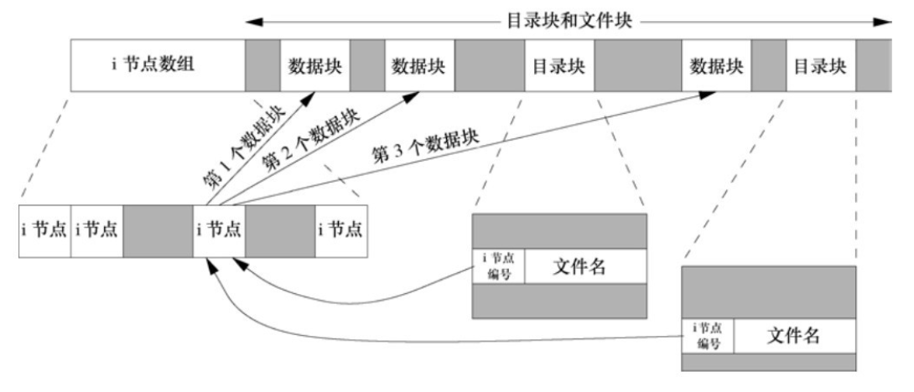
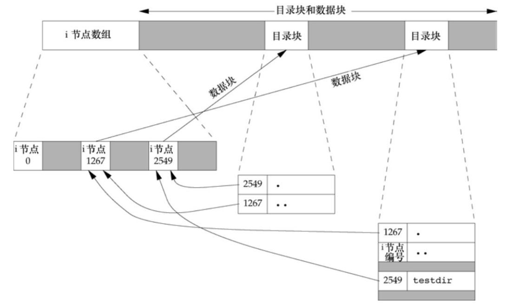

## 4文件和目录

### 4.2函数stat、fstat、fstatat和lstat

四个`stat`函数的主要作用是获取文件状态信息。

```c
#include<sys/stat.h>
int stat(const char *restrict pathname, strcut stat *restrict buf);
int fstat(int fd, strcut stat *buf);
int lstat(const char *restrict pathname, struct stat *restrict buf);
int fstatat(int fd, char *restrict pathname, struct stat *restrict buf, int flag);
//所有四个函数的返回值：若成功，返回0；若失败，返回-1
```

这四种函数的区别：

- `stat()`获取与参数`pathname`路径下命名文件相关的信息结构。

- `fstat()`获取已在参数`fd`上打开文件的相关信息。

- `lstat()`类似`stat()`，但当该文件是符号链接时，`lstat()`获取的是该符号链接本身的有关信息，而`stat()`获取的是该符号链接引用的文件的信息。

- `fstatat()`获取一个相对于参数`fd`打开目录的路径名，与参数`pathname`路径下命名文件相关的信息结构。
  - `flag`参数控制着是否跟随着一个符号链接：
    - 当`flag`设置为`AT_SYMLINK_NOFOLLOW`时，`fstatat()`不会跟随符号链接，而是获取的符号链接本身的有关信息。
    - 默认的`flag`是获取符号连接引用的文件的信息。
  - `fd`参数控制着路径的选择：
    -  当参数`fd`设置为`AT_FDCWD`，并且`pathname`参数是一个相对路径名，`fstatat()`会计算相对于当前目录的`pathname`参数。
    - 如果`pathname`参数是一个绝对路径，则忽略`fd`参数。

第二个参数`buf`是一个传出参数指针，它指向的`stat`结构的基本形式是：

```c
struct stat {
	mode_t 						st_mode;							//文件类型和文件权限(file type & mode(permission))
	ino_t	 						st_ino;								//i节点号(i-node number(serial number))
	dev_t  						st_dev;								//文件系统的设备号(device number(file system)) 类似sda0 sda1...
	dev_t  						st_rdev;							//特殊设备的设备号(device number for special files)
	nlink_t						st_nlink;							//硬连接数(number of links)
	uid_t 						st_uid;								//所属者的用户id(user id for owner)
	gid_t							st_gid;								//所属组的组id(group id for owner)
	off_t							st_size;							//普通文件字节大小(size in bytes, for regular files)
	struct timespec 	st_atime;							//上次访问时间(time of last access)
  struct timespec 	st_mtime;							//上次修改时间(time of last modification)
  struct timespec 	st_ctime;							//上次文件状态修改时间(time of last file status change)
  blksize_t 				st_blksize;						//建议的I/O块大小(best I/O block size)
  blkcnt_t					st_blocks;						//分配的磁盘块数量(number of disk blocks allocated)
};
```

`stat`结构中的`timespec`结构类型按照秒和纳秒定义了时间，至少包括下面两个字段：

```c
struct timespec {
  time_t	 tv_sec;							//秒
	long 		 tv_nsec;							//纳秒
};
```

### 4.3文件类型

unix系统的文件类型主要有7种：

1. **普通文件**(regular file)。这是最常用的文件类型，这种文件包含了某种形式的数据。至于这种数据是文本还是二进制数据，对于unix内核而言并无区别。由处理该文件的应用程序解释文件内容。
2. **目录文件**(directory file)。这种文件包含了其他文件的名字以及指向与这些文件有关信息的指针。对一个目录文件具有读权限的任一进程都可以读该目录的内容，但只有内核文件可以直接写目录文件。
3. **块特殊文件**(block special file)。这种类型的文件提供对设备的(如磁盘)带缓冲的访问，每次访问以固定长度为单位进行。
4. **字符特殊设备**(character special file)。这种类型的文件提供对设备不带缓冲的访问，每次访问长度可变。

> 系统中的所有设备要么是字符特殊文件，要么是块特殊文件。
>
> FreeBSD不再支持块特殊文件。对设备的访问需要通过字符特殊文件进行。

5. **FIFO**。这种类型的文件用于进程间通信，有时也称为**命名管道**(named pipe)。
6. **套接字**(socket)。这种类型的文件用于进程间的网络通信。套接字也可用于在一台宿主机上进程之间的非网络通信(unix socket)。
7. **符号连接**(symbolic link)。这种类型的文件指向另一个文件。

文件类型的信息包含在`stat`结构的`st_mode`成员中。利用相关宏来确定文件类型：(参数为`st_mode`)

1. `S_ISREG()`:   普通文件
2. `S_ISDIR()`:    目录文件
3. `S_ISCHR()`:   字符特殊文件
4. `S_ISBLK()`:    块特殊文件
5. `S_ISFIFO()`:   管道或FIFO
6. `S_ISLNK()`:    符号链接
7. `S_ISSOCK()`:  套接字

> 这些宏本质上是逻辑“与运算”：
>
> ```c
> #define S_ISDIR(mode) (((mode) & S_IFMT) == S_IFDIR)
> ```

POSIX.1允许实现将**进程间通信**(IPC)对象(如消息队列和信号量等)说明为文件。

可用以下宏从`stat`结构中确定IPC对象类型：(参数为`stat`结构指针)：

- `S_TYPEISMQ()`:		消息队列
- `S_TYPEISSEM()`:	   信号量
- `S_TYPEISSHM()`:       共享内存

### 4.4设置用户id和设置组id

与一个进程相关的id有6个或更多：

- **实际用户id**和**实际组id**。表示登录用户项。这两个字段在登录时取自口令文件中的登录项。通常，在一个登录会话期间并不会改变，但是root用户进程有办法改变它们。
- **有效用户id**和**有效用户组id**以及**附属组id**。此项决定了实际的文件访问权限。
- 保存的**设置用户id**和保存的**设置组id**。该项在执行一个程序时保存了有效用户id和有效组id的副本。

> 通常， 有效用户id等于实际用户id， 有效组id等于实际组id。

每个文件都有一个**所属者**和**所属组**，所属者由`stat`结构中的`st_uid`指定，所属组则由`st_gid`指定。

当执行一个程序文件时，可在`stat`结构中的`st_mode`设置一个特殊标志位(粘着位)：

- 设置用户id位时，则将进程的有效用户id设置为文件所属者的用户id(`st_uid`)。
- 设置组id位时，则将进程的有效用户组id设置为文件所属组的组id(`st_gid`)。

设置用户id位和设置组id位都包含在文件的`st_mode`值中。可通过下列宏确定：(参数为`st_mode`)

- `S_ISUID`:	检查是否设置了设置用户id位。
- `S_ISGID`:    检查是否设置了设置组id位。

### 4.5文件访问权限

`st_mode`也包含了对文件的访问权限。所有的文件类型(目录、字符特殊文件等)都具有访问权限(access permission)：

- 所属者权限：                                     八进制权限值
  - `S_IRUSR`:         所属者读权限           0400
  - `S_IWUSR`:	    所属者写权限	        0200
  - `S_IXUSR`:         所属者执行权限       0100
- 所属组权限：
  - `S_IRGRP`: 		所属组读权限			0040
  - `S_IWGRP`:	    所属组写权限             0020
  - `S_IXGRP`:         所属组执行权限        0010
- 其他人权限：
  - `S_IROTH`: 	    其他人读权限            0004
  - `S_IWOTH`：     其他人写权限             0002
  - `S_IXOTH`：      其他人执行权限        0001

> 助记：S_I->检测； R->读(read)，W->写(write)，X->执行(exec)；USR->所属者(user)，GRP->所属组(group)，OTH->其他人(others)
>
> 对访问权限的设置既可以用宏，也可以直接用8进制权限值。8进制可直接累加权限，列如：0777。

**文件访问权限的规则**：

1. 当用路径名打开任意类型的文件时，对该文件中包含的每一级目录，包括它可能隐含的当前工作目录都应具有执行权限。

> 因此对于目录而言其执行位常被称为搜索位。例如为打开`/usr/include/stdio.h`文件，需对目录`/`、`/usr`和`/usr/include/`都具有执行权限。

2. 对于一个文件的读权限决定了实际是否能够打开现有文件进行读操作。
3. 对于一个文件的写权限决定了实际是否能够打开现有文件进行写操作。
4. 为了在`open()`中对一个文件指定`O_TRUNC`标志，必须对该文件具有写权限。
5. 为了在一个目录中创建一个新文件，必须对该目录具有写权限和执行权限。
6. 为了删除一个现有文件，必须对包含该文件的目录具有写权限和执行权限。对该文件本身则不需要有读、写权限。
7. 若用`exec`系列函数中的任何一个执行某个文件，斗必须对该文件具有执行权限。该文件还必须是一个普通文件。

进程每次打开、创建或删除一个文件时，内核就依顺序进行这4步文件**访问权限检测**：(只要有一步通过，则不再进行检测。)

1. 若进程的有效用户id是0(root)，则允许访问。root用户具有对整个文件系统进行处理的权限。
2. 若进程的有效用户id等于文件的所属者id(也就是进程拥有此文件)，则进程对文件的访问权限等于该文件所属者的访问权限。
3. 若进程的有效组id或进程的附属组id之一等于文件的所属组id，那么进程对文件的访问权限等于该文件所属组的访问权限。
4. 上述均不符合，则进程对文件的访问权限等于该文件其他人的访问权限。

### 4.6新文件和目录的所有权

新文件的所属者id设置为进程的有效用户id。而关于所属组id，POSIX.1允许实现选择下列之一：

- 新文件的所属组id可以是进程的有效组id。
- 新文件的所属组id可以是它所在目录的所属组id。(继承目录的所属组id)

### 4.7函数access和faccessat

`access()`和`faccessat()`主要作用是根据实际用户id和实际组id进行访问权限检测：

> 调用`open()`打开一个文件时，内核以进程的有效用户id和有效组id为基础进行访问权限检测。

```c
#include<unistd.h>
int access(const char *pathname, int mode);
int faccessat(int fd, const char *pathname, int mode, int flag);
//两个函数的返回值：若成功，返回0；若出错，返回-1
```

参数`mode`决定函数的功能：

- `F_OK`： 测试文件是否已经存在。
- `R_OK`： 测试是否具有读权限。
- `W_OK`：测试是否具有写权限。
- `X_OK`： 测试是否具有执行权限。

> access和faccessat的关于文件路径上的区别与之前at系函数的相同。之后不再说明。

参数`flag`可以用于改变`faccessat()`的行为：

- 若`flag`设置为`AT_ACCESS`，访问检测是调用进程的有效用户id和有效组id。
- 默认`flag`则访问检测的是实际用户id和实际组id。

### 4.8函数umask

`umask()`为进程设置创建文件时的权限屏蔽字，并返回之前的屏蔽字：

```c
#include<sys/stat.h>
mode_t umask(mode_t cmask);
//函数的返回值：之前的文件创建的权限屏蔽字
```

参数`cmask`可取自文件权限中的所有9项。

在创建文件时权限屏蔽字中为1的位，文件创建后的权限中相应的位一定被关闭。

### 4.9函数chmod、fchmod、fchmodat

`chmod()`、`fchmod()`和`fchmodat()`这三个函数使我们可以更改现有文件的访问权限。

```c
#include<sys/stat.h>
int chmod(const char *pathname, mode_t mode);
int fchmod(int fd, mode_t mode);
int fchmodat(int fd, const char *pathname, mode_t mode, int flag);
//三个函数返回值：若成功，返回0；若出错，返回-1
```

`chmod()`在指定的文件上进行更改操作。

`fchmod()`则对已经打开的文件进行操作。

`fchmodat()`中参数`flag`会改变函数的行为：

- 若`flag`设置为`AT_SYMLINK_NOFOLLOW`标志时，`fchmodat()`并不会跟随符号链接。
- 默认`flag`则会跟随符号链接的引用。

参数`mode`可取自文件权限中的所有9项，还可取另外6项：

- 粘着位：
  - `S_ISUID`：  执行时使用设置用户id             4000
  - `S_ISGID`:     执行时使用设置组id                 2000
  - `S_ISVTX`：  保存正文                                    1000
- 所属者权限：
  - `S_IRWXU`： 所属者读、写和执行权限           0700
- 所属组权限：
  - `S_IRWXG`： 所属者读、写和执行权限           0070

- 其他人权限： 
  - `S_IRWXO`：其他人读、写和执行权限            0007

### 4.10粘着位(sticky bit)

如果一个可执行程序文件设置了`S_ISVTX`位，当该程序第一次被执行，在其终止时，程序正文部分(.text段)的一个副本仍被保存在交换区。使得下次执行该程序能较快地加载进内存。
因为在系统再次自举前，文件的正文部分总是在交换区中，这正是名字“粘着”的由来。后来的uinx版本称它为保存正文位(saved-text-bit)，因此也就有常量`S_ISVTX`。现较新的unix系统大多数都配置了虚拟存储系统以及快速文件系统，所以不再需要使用这种技术。
如今的系统扩展了粘着位的使用范围，SUS允许针对目录设置粘着位。如果对一个目录设置了粘着位，只有对该目录具有写权限的用户并且满足下列条件之一，才能删除或重命名该目录下的文件：

- 拥有此文件
- 拥有此目录
- 是root用户

> 例如目录`/tmp`和`/var/tmp`是设置粘着位的典型候选者——任何用户都可在这两个目录中创建文件。任一用户(用户、组和其他)对这两个目录的权限通常都是读、写和执行。但是用户不应能删除或重命名属于其他人的文件，为此在这两个目录的文件权限中都设置了粘着位。

### 4.11函数chown、fchown、fchownat和lchown

这四个`chown`函数用于更改文件的所属者的用户id和所属组的组id。若参数`owner`或`group`中的任意一个是-1，则对应的id不变。

```c
#include<unistd.h>
int chown(const char *pathname, uid_t owner, gid_t group);
int fchown(int fd, uid_t owner, gid_t group);
int fchownat(int fd, const char *pathname, uid_t owner, gid_t group, int flag);
int lchown(const char *pathname, uid_t owner, git_t group);
//4个函数的返回值：若成功，返回0；若出错，返回-1
```

`fchownat()`中参数`flag`会改变函数的行为：

- 若`flag`设置为`AT_SYMLINK_NOFOLLOW`标志，`fchownat()`与`lchown()`行为相同，即不跟随符号链接。
- 默认`flag`时，`fchownat()`与`fchown()`行为相同。

基于BSD的系统一直规定只有root用户才能更改一个文件的所属者。这样做的原因是防止用户更改其文件的所属者从而摆脱磁盘空间限额对其的限制。System V则允许任一用户更改他们所拥有的文件的所属者。

若`_POSIX_CHOWN_RESTRICTED`对指定的文件生效，则：

- 只有root用户进程能更改该文件的用户id。
- 如果进程拥有此文件(进程的有效用户id等于该文件所属者的用户id)，参数`owner`等于-1或文件的所属者用户id，并且参数`group`等于进程的有效组id或进程的附属组id之一，那么一个非root用户也可以更改该文件所属组的组id。

> 当`_POSIX_CHOWN_RESTRICTED`有效时，不能更改其他用户文件所有者的用户id。但可以更改实际所拥有的文件所属组的组id到实际所属的组之一。

若这4个函数由非root用户进程调用，则在成功返回时，该文件的设置用户id位和设置组id位都被清除。

### 4.12文件长度

`stat`结构成员`st_size`表示以字节为单位的文件的长度。此字段只对普通文件、目录文件和符号链接有意义。

- 对于普通文件，其长度可以是0，在开始读这种文件时，将得到文件结束(end-of-file)指示。
- 对于目录文件，文件长度通常是一个数(如16或512，4K)的整数倍。
- 对于符号链接，文件长度是在文件名中的实际字节数

> 例如 lrwxrwxrwx  1  root  				7  Sep 25 07:14 lib -> usr/lib 。则lib文件的长度7就是路径名usr/lib的长度。

大多数现代unix系统也提供字段`st_blksize`和`st_blocks`。其中，第一个是对文件I/O较合适的块长度，第二个是所分配的实际块数量。为了提高效率，标准I/O库会试图一次读写`st_blksize`个字节。

### 4.13文件截断

调用`open()`打开文件时使用`O_TRUNC`标志可以将一个文件的长度截断为0。

调用`truncate()`和`ftruncate()`也可以截断文件。

```c
#include<unistd.h>
int truncate(const char *pathname, off_t length);
int ftruncate(int fd, off_t length);
//两个函数的返回值：若成功，返回0；若出错，返回-1
```

这两个函数将一个现有文件的长度截断为参数`length`：

- 若该文件之前的长度大于参数`length`，则超过`length`以外的数据就不能再访问了。
- 若以前的长度小于参数`length`，文件的长度将增加，增加部分的数据将读作0(存在文件空洞)。

### 4.14文件系统

普通文件的链接计数概念：



- 图中有两个目录项指向同一个i-node。每个i-node中都有一个链接计数，其值是指向该i-node的目录项数。只有当链接计数减少至0时，才可删除该文件(可释放该文件占用的数据块)。亦即删除一个目录项的函数名为unlink而非delete。在`stat`结构中，链接计数包含在`st_nlink`成员中，其基本系统数据类型时是`nlink_t`。这种链接类型称为**硬链接**。

> POSIX.1中长量`LINK_MAX`指定了一个文件链接数的最大值。

- 另一种链接类型为**符号链接**(symbolic link)。符号链接文件的实际内容是该符号链接所指向的文件的名字。该i-node中的文件类型是`S_IFLNK`。
- i-node包含了文件有关的所有信息：文件类型(7种)、文件访问权限位、文件长度和指向文件数据块的指针等。`stat`结构中的大多数信息都取自i-node。文件项只含有文件名和i-node编号。i-node编号的数据类型为`ino_t`

- 因为目录项中的i-node编号指向同一文件系统的相应i-node，所以一个目录不能指向另一个文件系统的i-node(不能跨越文件系统)。
- 当在不更换文件系统的情况下为一个文件重命名时，该文件的实际内容并未移动，只需构造一个指向现有i-node的新目录项，并删除旧的目录项。链接计数并不会改变。

目录文件的链接计数概念：



- 任何以个叶目录(不包含任何其他目录的目录)的链接计数总是2。数值2来自命名该目录的目录项以及在该目录中的.项。
- 在该目录下创建一个目录时，该目录的链接计数大于或等于3。主要是因为至少有3个目录项指向它：一个是命名它的目录项。一个是在该目录项中的.项，一个是在其刚创建的目录下的..项。

> 所以在父目录中的每一个子目录都会使该父目录的链接计数增加1。

### 4.15函数link、linkat、unlink、unlinkat和remove

调用`link()`和`linkat()`可以创建一个指向现有文件的链接(硬链接)。

```c
#include<unistd.h>
int link(const char *existingpath, const char *newpath);
int linkat(int efd, const char *existingpath, int nfd, cosnt *newpath, int flag);
//两个函数的返回值：若成功，返回0；若失败，返回-1
```

这两个函数创建一个新目录项`newpath`，它引用现有文件`existingpath`。如果`newpath`已经存在，则返回出错。成功则只创建`newpath`的最后一个分量，路径中的其他部分应当已经存在。

> 对于`linkat()`，现有的文件是通过`efd`和`existingpath`参数指定的，新的路径名是通过`nfd`和`newpath`参数指定的。

`linkat()`中参数`flag`会改变函数的行为：

- 若`flag`设置为`AT_SYMLINK_NOFOLLOW`标志，创建指向参数`existingpath`符号链接目标的链接。
- 默认`flag`时，创建一个指向参数`existingpath`符号链接本身的链接。

创建新目录项和增加链接计数是一个原子操作。

> 很多文件系统实现不允许对于目录的硬连接，因为可能在文件系统中形成循环。若支持，也仅限root用户可行。

调用`unlink()`可以删除一个现有的目录项。

```c
#include<unistd.h>
int unlink(const char *pathname);
int unlinkat(int fd, const char *pathname, int flag);
//两个函数的返回值：若成功，返回0；若出错，返回-1
```

这两个函数删除目录项，并将参数`pathname`所引用文件的链接计数减1。如果对该文件还有其他链接，则仍可通过其他链接访问该文件的数据。若函数出错，则不对该文件做任何更改。

> 只有当链接计数达到0时，还文件的内容才可被删除。关闭一个文件时，内核首先检查打开该文件的进程个数；如果该计数为0，内核再检查文件的链接计数；如果该计数也为0，则删除该文件的内容。
>
> 所以`unlink()`可以用来确保进程崩溃时，该进程创建的临时文件也不会被遗留下来。(进程调用`open()`或`creat()` 然后`unlink()`便得到临时文件)

`unlinkat()`中参数`flag`会改变函数的行为：

- 若`flag`设置为`AT_REMOVEDIR`标志，`unlinkat()`与`rmdir()`一样可以删除目录。
- 默认`flag`时，与`unlink()`一样，只能删除文件。

如果参数`pathname`是符号链接(软链接)，则`unlink()`删除该符号链接本身，而不是删除由该链接所引用的文件。

> 给出符号链接名的情况下，没有函数能删除由该链接所引用的文件。

如果文件系统支持的话，root用户可以调用`unlink()`，其参数`pathname`指定一个目录。

对于文件，`remove()`的功能与`unlink()`相同，对于目录，`remove()`的功能与`rmdir()`相同。

```c
#include<stdio.h>
int remove(const char *pathname);
//函数的返回值：若成功，返回0；若出错，返回-1
```

### 4.16函数rename和renameat

文件或目录可以用`rename()`或`renameat()`进行重命名。

```c
#include<stdio.h>
int rename(const char *oldname, const char *newname);
int renameat(int oldfd, const char *oldname, int newfd, const char *newname);
//两个函数的返回值：若成功，返回0；若出错，返回-1
```

根据参数`oldname`是指文件、目录还是符号链接，情况有所不同：

- 若`oldname`指向的不是一个目录，那么为该文件或符号链接重命名。
  - 若`newname`已经存在且为目录，则出错。
  - 若`newname`已存在且不为目录，则先将该目录项删除然后将`oldname`的目录项重命名为`newname`。

- 若`oldname`指向的是一个目录，那么为该目录重命名。
  - 若`newname`已存在且不为目录，则出错。
  - 若`newname`已存在且为空目录(仅含.和..项)，则先将其删除，然后将`oldname`重命名为`newname`。
  - 若`newname`已存在且为非空目录，则出错。

> `newname`不能包含`oldname`作为其路径前缀。

- 若`oldname`或`newname`引用符号链接，则处理的是符号链接本身，而非所引用的文件。
- 不能对`.`和`..`项重命名，亦这两项不能出现在`oldname`和`newname`的最后部分。
- 若`oldname`和`newname`为同一文件，则函数不做任何更改直接成功返回。

> 如果`newname`文件已经存在，则调用进程对它需具有写权限(如同删除情况一样)。
> 
> 调用进程对`oldname`和`newname`文件项的修改还需对包含`oldname`和`newname`的目录具有写和执行权限。

### 4.17符号链接

硬链接直接指向文件的i-node，而符号链接是对一个文件的间接指针。主要是避免硬连接的一些限制：

- 硬连接通常要求链接和文件位于同一文件系统中。
- 只有root用户才可能创建指向目录的硬链接。

> 而对符号链接以及它指向何种对象并无任何文件系统限制，且任何用户都可以创建指向目录的符号链接。

### 4.18创建和读取符号链接

调用`symlink()`或`symlinkat()`创建一个符号链接。

```c
#include<unistd.h>
int symlink(const char *actualpath, const char *sympath);
int symlinkat(const char *actualpath, int fd, const char *sympath);
//两个函数的返回值：若成功，返回0；若出错，返回-1
```

这两个函数创建了一个指向`actualpath`目录项的新目录项`sympath`。在创建此符号链接时，并不要求`actualpath`已经存在。并且`actualpath`和`sympath`并不需要位于同一文件系统中。

调用`readlink()`和`readlinkat()`来打开符号链接本身，读取该文件中的路径名。

```c
#include<unistd.h>
ssize_t readlink(const char *restrict pathname, char *restrict buf, size_t bufsize);
ssize_t readlinkat(int fd, const char *restrict pathname, char *restrict buf, size_t bufsize);
//两个函数的返回值：若成功，返回读取的字节数；若出错，返回-1
```

这两个函数组合了`open()`、`read()`和`close()`的所有操作。若函数成功执行，则返回读入`buf`的字节数。在`buf`中返回的符号链接的内容不以`null`字节终止。

### 4.19文件时间

对每个文件状态信息维护3个时间字段：

- `st_atime`，文件数据的上次访问时间，a -> access，`read()`会触发修改，`ls -u`查看
- `st_mtime`，文件数据的上次修改时间，m -> modification，`write()`会触发修改，`ls`查看
- `st_ctime`，i-node状态的上次更改时间，c -> change，`chmod()`、`chown()`会触发修改，`ls -c`查看

> 影响i-node状态的操作主要有更改文件的访问权限、更改文件所属者的用户id、更改链接计数等。
>
> 注意，系统并不维护对一个i-node的上次访问时间，所以`access()`和`stat()`并不影响这三个时间。

### 4.20函数futimens、utimensat和utimes

调用`futimens()`和`utimensat()`可以更改文件的上次访问和修改时间。

```c
#include<sys/stat.h>
int futimens(int fd, const struct timespec times[2]);
int utimensat(int fd, const char *path, const struct timespec times[2], int flag);
//两个函数的返回值：若成功，返回0；若出错，返回-1
```

这两个函数的`times`数组参数的第一个元素包含访问时间，第二个元素包含修改时间。这两个时间均是日历时间。

时间戳可以按下列方式进行指定：

1. 若`times`参数是一个空指针，则访问时间和修改时间两者都设置为当前时间。

2. 若`times`参数指向两个`timespec`结构的数组：

   - 任一数组元素的`tv_nsec`字段的值为`UTIME_NOW`，相应的时间戳就设置为当前时间，忽略相应的`tv_sec`字段。等效于空指针情况，两种情况均要求进程对文件具有写权限，或为`root`用户进程。

   - 任一数组元素的`tv_nsec`字段的值为`UTIME_OMIT`，相应的时间戳保持不变，忽略相应的`tv_sec`字段。不执行任何权限检查。
   - `tv_sec`字段的值既不是`UTIME_NOW`也不是`UTIME_OMIT`，则相应的时间戳设置为相应的`tv_sec`和`tv_nsec`字段的值。要求进程的有效用户id等于文件所属者的用户id，或为root用户进程。仅对文件有权限无法更改。

`utimensat()`中参数`flag`会改变函数的行为：

- 若`flag`设置为`AT_SYMLINK_NOFOLLOW`标志，则修改符号链接本身的时间。
- 默认`flag`时，修改符号链接引用文件的时间，同时引用文件的时间改成符号链接的时间。

调用`utimes()`对参数`pathname`进行修改，`times`参数时指向包含两个时间戳(访问时间和修改时间)元素的数组指针。

```c
#include<sys/time.h>
int utimes(const char *pathname, const struct timeval times[2]);
//函数的返回值：若成功，返回0；若出错，返回-1
```

> 我们不能对状态的上次更改时间`st_ctime`指定一个值，因为调用`utimes()`时，此字段会被自动更新。

### 4.21函数mkdir、mkdirat和rmdir

调用`mkdir()`和`mkdirat()`创建一个新的空目录，其中.和..目录项自动创建的。

```c
#include<sys/stat.h>
int mkdir(const char *pathname, mode_t mode);
//两个函数的返回值：若成功，返回0；若出错，返回-1
```

> 常见的错误是只指定了读写权限。而目录通常指少要设置一个执行权限位，以允许访问该目录的文件名。

调用`rmdir()`可以删除一个空目录。空目录是只包含`.`和`..`这两项的目录。

```c
#include<unistd.h>
int rmdir(cosnt char *pathname);
//函数的返回值：若成功，返回0；若出错，返回-1
```

若调用此函数使目录的链接计数成为0时：

- 若没有其他进程打开此目录，则释放由此目录占用的空间。

- 若有一个或多个进程打开此目录，则在此函数返回前删除最后一个链接及`.`和`..`项。且在此目录中不能创建新文件。直到最后一个进程关闭它再释放此目录。

### 4.22读目录

对某个目录具有执行权限的任一用户都可以读该目录文件，但为了防止文件系统产生混乱，只有内核才能写目录文件本身的信息。

> 目录有关信息并非只有其包含的各文件名，还应有目录文件本身的信息，目前已知的是包含的各目录项。

```c
#include<dirent.h>
DIR *opendir(const char *pathname);
DIR *fdopendir(int fd);
//两个函数的返回值：若成功，返回指针；若出错，返回NULL
struct dirent *readdir(DIR *dp);
//函数的返回值：若成功，返回指针；若在目录尾或出错，返回NULL
void rewindder(DIR *dp);
int closedir(DIR *dp);
//函数的返回值：若成功，返回0；若出错，返回-1
long telldir(DIR *dp);
//函数的返回值：与dp关联的目录中的当前位置
void seekdir(DIR *dp, long loc);
```

`fdopendir()`可以将参数`fd`转换成目录处理函数所需要的`DIR`结构。

定义在头文件`<dirent.h>`中的`dirent`结构与实现有关，但它至少包含两个成员：

```c
struct dirent {
	ino_t d_ino;								//i-node号(i-node number)
	char d_name[];							//null结尾的字符串(null-terminated filename)
}
```

> 注意`d_name`项的大小并没有指定，但必须保证它能包含至少`NAME_MAX`个字节(不包含终止`null`字节)。

`DIR`结构保存正在被读的目录文件本身的信息。

`opendir()`执行初始化操作后，`readdir()`返回目录中的第一个目录项。

`fdopendir()`创建的`DIR`结构，`readdir()`返回的第一个目录项取决于传给`fdopendir()`的参数`fd`相关联的文件偏移量。

> 注意，目录中各目录项的顺序与实现有关，通常并不按字母顺序排列。

### 4.23函数chdir、fchdir和getcwd

每个进程都有一个当前工作目录，此目录是该进程内所有相对路径名的起点(不以斜线开始的路径名)。

> 当前工作目录是进程的属性，家目录则是登陆名的属性。

调用`chdir()`和`fchdir()`可以更改当前进程的工作目录。

```c
#include<unistd.h>
int chdir(const char *pathname);
int fchdir(int fd);
//两个函数的返回值：若成功，返回0；若出错，返回-1
```

对于进程保存更改前的工作目录，`chdir()`前需调用`getcwd()`利用缓冲区来保存绝对路径名，而`fchdir()`前只需调用`open()`利用`fd`保存当前工作目录。

调用`getcwd()`可以获得当前进程工作目录的绝对路径名。

```c
#include<unistd.h>
char *getcwd(char *buf, size_t size);
//函数的返回值：若成功，返回buf；若出错，返回NULL
```

参数`buf`指向足够容纳绝对路径名(包括终止符`null`)的缓冲区地址

参数`size`为该缓冲区的字节大小。

> `getcwd()`的原理是利用`..`目录项找到上一级目录，直到该目录项的i-node号与..目录项的i-node相同。则找到了其绝对路径名。

### 4.24设备特殊文件

每个文件系统所在的存储设备都由其主、次设备号表示。设备号所用的数据类型是基本系统数据类型`dev_t`。

主设备号标识设备驱动程序，次设备号标识特定的子设备。可以用宏：`major`和`minor`来访问主、次设备号。

系统中与每个文件名关系的 `st_dev`值是文件系统的设备号，该文件系统包含了这一文件名以及与其对应的i-node。

只有字符特殊文件和块特殊文件才有`st_rdev`值。此值包含实际设备的设备号。

