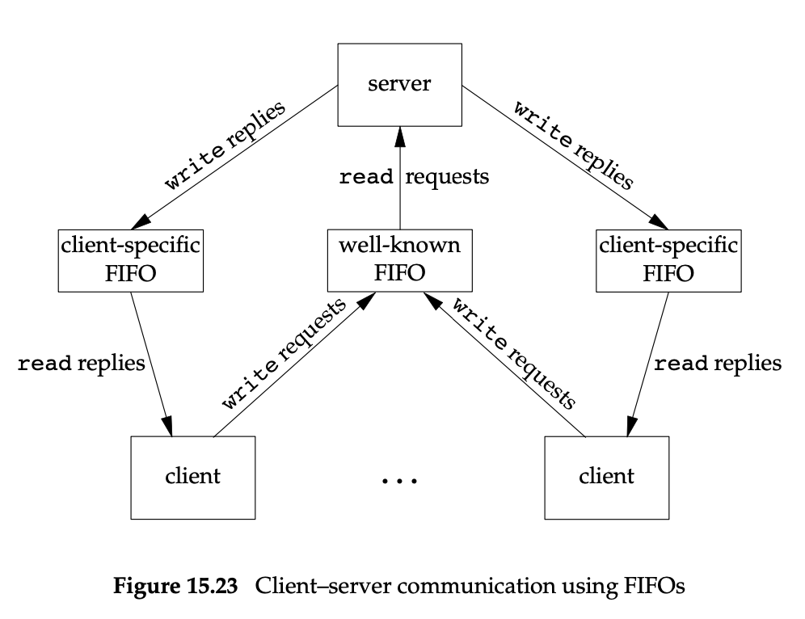

## 个人思考

### 1.I/O同步与异步

同步与异步通过I/O操作线程与资源处理线程的相对关系来区别：

- 同步I/O：即I/O操作相对于资源处理线程是协同步骤。资源即为I/O操作所得到的数据。而引入多路复用I/O(select、poll、kqueue、epoll)就是为了避免同步I/O操作的阻塞问题，从而提高后续资源处理效率。
- 异步I/O：即I/O操作相对于资源处理线程是异构步骤。异步I/O基本上离不开信号，通过入队其他线程的读写队列完成I/O操作，信号通知申请线程可以进行资源处理。一般异步I/O需要提供数据存储缓冲区，待异步I/O操作完成后便可直接对该缓冲区进行后续操作。

而阻塞和非阻塞则是I/O操作的属性概念：

- 阻塞，I/O操作中read操作会阻塞调用线程等待有数据产生，而写缓冲区填满后write操作会阻塞调用线程等待缓冲区可写。不止I/O操作有这种属性，很多系统调用都有阻塞属性，这些系统调用也被称为慢速系统调用。阻塞期间调用线程会被挂起，以让出CPU资源。
- 非阻塞，I/O操作不会等待上述事件的发生，调用时若无法完成相关操作则直接返回，并会设置errno告知调用线程。非阻塞一般和轮询(polling)或自旋(spin)一起使用，以避免调用线程进入挂起状态，会无意义的占用CPU资源。对于确定操作能在短时间内完成，可以采用轮询+非阻塞达到高效率，否则一般采用事件监听+非阻塞。

事件即相关操作对操作对象所关心的状态变化，read操作只关心读取的对象是否可读，write操作只能关心写对象是否可写，等等。多路复用I/O本质则是将这些事件集合起来监听。

### 2.网络编程

apue对网络编程的部分只提及了相关api。但是在IPC章FIFO的应用中却提供了值得深思的网络模型：

对request请求与respone请求的分离，既可以快速响应发送结果，又可以高效处理单一事件。

个人构想：那么对于利用nginx做前方反向代理服务器，而后方web处理服务器集群的构造来说，后方服务器能够直接对客户的作出response？

可行性：

- 若web服务器支持外网，则nginx服务器先给客户端repsonse，其中带有后方服务器地址。(一般不推荐，容易暴露后方服务)
- 若web服务器仅支持内网，则nginx服务器做临时端口转发，web服务器通过端口转发与客户端直接连接。而nginx服务器与web服务器之间并行多端口长连接。

## 说明

本仓库是对Advance Progammming in the UNIX Environment一书的摘要笔记，作为可随时随地快速翻阅复习用。本人不推荐仅看一些快消技术博客(包括本仓库)，十分推荐阅读原书以深度理解。以上思考是作为一名初学者的理解和猜想，若有错误希望得到指点。